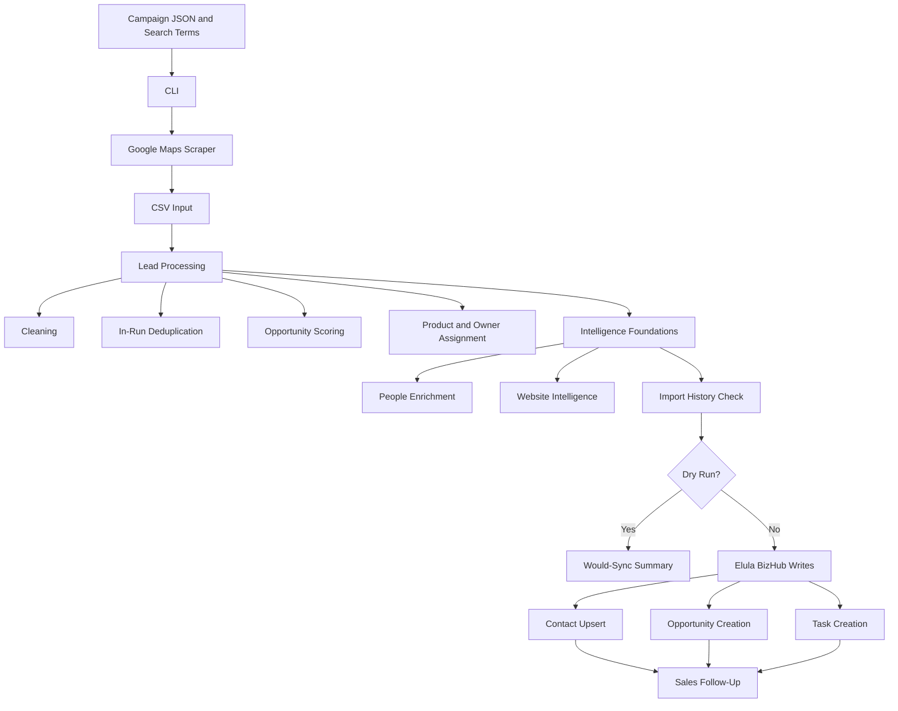
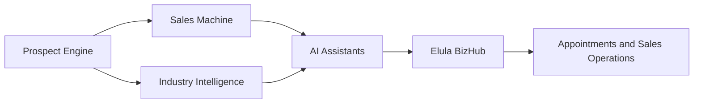

# Architecture

## Purpose

This document explains how Elula Prospect Engine is structured. For onboarding sequence and operating rules, use [Project Context](PROJECT_CONTEXT.md) as the source of truth.

## Current Architecture

Detailed current flow:

## Future Platform Architecture

Future roles:

- Prospect Engine: discovers and qualifies business prospects.
- Sales Machine: manages outreach and follow-up execution.
- Industry Intelligence: provides market, sector, and campaign context.
- AI Assistants: support call prep, outreach, summaries, and operational execution.
- Elula BizHub: remains the CRM and automation control center.

## CLI

Implemented commands:

- `process`: process CSV files into prospect exports.
- `run`: run the Google Maps scraper workflow.
- `execute`: run scraper, processing, enrichment checks, duplicate checks, and optional sync.
- `refresh-ghl-metadata`: refresh local Elula BizHub metadata.

Execution controls:

- `--limit`: restricts how many processed prospects are checked after processing.
- `--dry-run`: prevents Elula BizHub writes and import history writes.

## Campaign Manager

Campaigns live under `campaigns/<industry>/<campaign>.json` with matching search terms in `.txt` files.

Campaign configuration controls:

- campaign identity;
- industry and geography;
- source;
- product focus;
- target pipeline;
- live sync enablement;
- active status.

## Lead Processing

Processing converts raw scraper CSV rows into structured prospects.

Implemented steps:

- cleaning;
- in-run deduplication;
- opportunity scoring;
- product assignment;
- owner assignment;
- CSV export.

## Duplicate Prevention

Duplicate prevention has two layers:

- in-run deduplication removes duplicates inside a single processed batch;
- import history prevents repeated Elula BizHub writes across runs.

Persistent import history is stored in `data/import_history.json`.

Match priority:

1. normalized website;
2. normalized phone;
3. normalized company name.

## Intelligence Layer

Implemented:

- people enrichment framework;
- website intelligence framework.

Planned:

- Google Business Profile Intelligence;
- decision-maker discovery;
- AI call preparation.

Current intelligence does not write new people or website fields into Elula BizHub. This prevents premature CRM field mapping and keeps production sync stable.

## Elula BizHub Integration

Elula BizHub integration is stored under `integrations/ghl/`.

Responsibilities:

- API communication;
- metadata refresh;
- contact upsert;
- opportunity creation;
- task creation;
- owner, pipeline, stage, and tag mapping.

The code may use GoHighLevel naming where required by API naming. User-facing documentation should use Elula BizHub.

## Dry Run

Dry-run mode exists to validate the workflow without live CRM writes.

Dry-run allows:

- scraper execution;
- processing;
- people enrichment;
- website intelligence;
- import history duplicate checks;
- would-sync summary.

Dry-run blocks:

- contact upsert;
- opportunity creation;
- task creation;
- import history writes.
