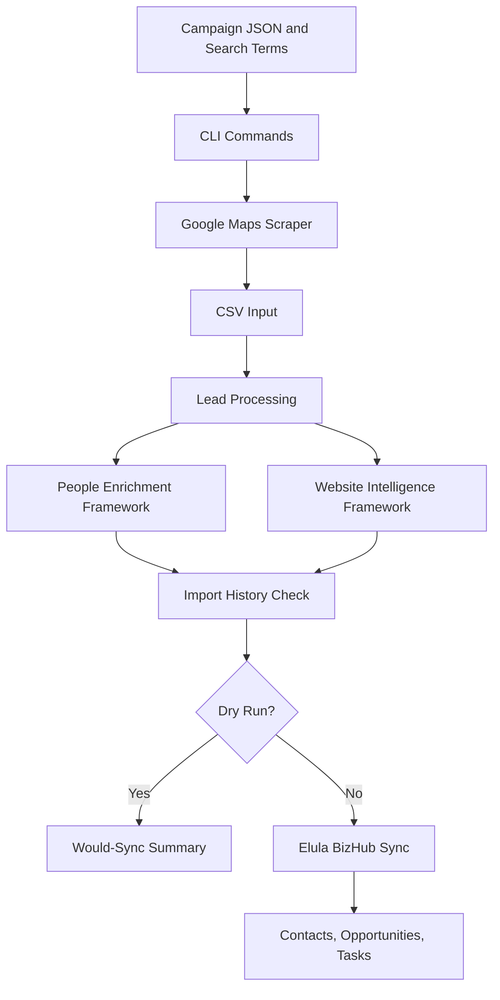

# Architecture

## Overview

Elula Prospect Engine is a Python CLI system organized around campaign execution, prospect processing, enrichment, duplicate prevention, and Elula BizHub sync.



## CLI

The CLI is defined in `main.py`.

Implemented commands:

- `process`: process CSV files into prospect exports.
- `run`: run the Google Maps scraper workflow.
- `execute`: run scraper, processing, enrichment checks, duplicate checks, and optional sync.
- `refresh-ghl-metadata`: refresh local Elula BizHub metadata.

Important execution controls:

- `--limit` restricts the number of prospects checked after processing.
- `--dry-run` runs safely without Elula BizHub writes or import history writes.

## Campaign Manager

Campaign configuration lives under `campaigns/<industry>/<campaign>.json`.

Campaign text queries live beside the JSON file as `.txt` files.

Campaign data controls:

- campaign identity;
- industry;
- province and country;
- source;
- primary and secondary product focus;
- pipeline;
- live sync enablement;
- active status.

## Lead Processing

Lead processing converts raw scraper CSV rows into structured prospects.

Processing includes:

- cleaning;
- deduplication;
- scoring;
- owner assignment;
- product assignment;
- CSV export.

## Cleaning

Cleaning standardizes fields before scoring and sync.

Current cleaning targets include:

- company names;
- phone numbers;
- website URLs;
- email values.

## Deduplication

There are two layers of deduplication:

```text
In-run deduplication
  Removes duplicates inside a single processed CSV batch.

Cross-run duplicate prevention
  Uses persistent import history to prevent repeated Elula BizHub writes.
```

Match preference:

1. normalized website;
2. normalized phone;
3. normalized company name.

## Opportunity Scoring

Opportunity scoring evaluates a prospect's readiness and quality using available data such as website, email, phone, and other prospect fields.

The score is used to support sales prioritization. It does not replace human qualification.

## Product Assignment

Product assignment determines the primary and secondary product focus for the prospect.

Current product context includes:

- Elula BizHub;
- Red XRay;
- Elula Mobile;
- future Elula Skills and Elula Compliance positioning.

## Owner Assignment

Owner assignment routes prospects to the correct internal owner for follow-up.

Owner metadata must match the refreshed Elula BizHub owner records before live sync.

## Import History

Import history is stored in `data/import_history.json`.

It prevents duplicate contacts, opportunities, and tasks across repeated runs.

Rules:

- Check import history before live Elula BizHub writes.
- Skip records that already exist in the ledger.
- Record a prospect only after contact upsert, opportunity creation, and task creation succeed.
- Do not write import history during dry-run mode.

## People Enrichment

People enrichment lives under `integrations/people/`.

Implemented foundation:

- `Person` dataclass.
- provider interface;
- empty provider;
- manual provider for controlled local testing;
- parser and merge logic.

Current behavior:

- runs safely;
- returns no people by default;
- does not call paid or external enrichment APIs;
- does not create people in Elula BizHub.

Future behavior:

- decision-maker discovery;
- role detection;
- confidence scoring;
- CRM field mapping when approved.

## Website Intelligence

Website intelligence lives under `integrations/website/`.

Implemented foundation:

- website reachability;
- HTTPS detection;
- title and meta description;
- contact, about, team, and careers page checks;
- email and phone extraction;
- social link detection;
- WhatsApp link detection;
- contact form detection;
- live chat indicators;
- analytics, tag manager, and Meta Pixel detection;
- basic CMS detection;
- website quality score;
- digital maturity score;
- findings and recommendations.

Current behavior:

- analyzes only one website per prospect;
- fetches the homepage and limited obvious pages;
- does not write website intelligence into Elula BizHub.

## Dry Run

Dry-run mode is a production safety feature.

Dry-run allows:

- scraper execution;
- processing;
- people enrichment;
- website intelligence;
- duplicate checks;
- would-sync summary.

Dry-run blocks:

- contact upsert;
- opportunity creation;
- task creation;
- import history writes.

## Elula BizHub Integration

Elula BizHub integration lives under `integrations/ghl/`.

Core responsibilities:

- API communication;
- metadata refresh;
- contact upsert;
- opportunity creation;
- task creation;
- owner, pipeline, stage, and tag mapping.

The code may reference GoHighLevel naming where required by API naming. User-facing documentation should use Elula BizHub.

## Future Google Business Intelligence

Planned for `v0.5`.

Expected signals:

- business profile completeness;
- ratings and review volume;
- category alignment;
- operating status;
- location relevance;
- service-area signals;
- profile quality indicators.

## Future AI Layer

Planned after stronger intelligence foundations are in place.

AI should support:

- call preparation;
- objection prediction;
- outreach personalization;
- business pain-point summaries;
- product-positioning recommendations.

AI should not replace operational safety controls, duplicate prevention, or CRM validation.
